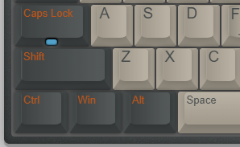

## Windows下模拟MacOS快捷键

双系统交替使用，两个系统的键位区别还是挺大的。本项目旨在尽可能的统一两个系统下的键位，做到无缝的切换。

经常 OS X和 Windows双系统交替使用，两个系统的键位区别还是挺大的。本项目旨在尽可能的统一两个系统下的键位，做到无缝的切换。

## 分析

OS X 的键位比较顺手，⌘承担主要全局快捷键，相当于Windows下Win&Ctrl。而且操作逻辑全局统一，比如最常用的复制Ctrl+C, Windows下大部分场景下是复制，但是在命令行下就变成了中断程序很容易出现误操作。

所以我的目标就是调整 Win 下的快捷键更接近⌘的功能， 为方便区分后面标记为Meta键。

## 方案

原期望使用[AutoHotKey](https://www.autohotkey.com/)完成所有按键的替换，但是再某些软件下映射不生效，为了保证最大的兼容性使用KeyTweak修改注册表的方式改键位。AutoHotKey只负责修改相应热键。使用[KeyTweak](.dist/KeyTweak.exe)调整按键：Caps Lock -> LCtrl, RCtrl -> LWindows, LWin -> LAlt, LAlt -> rCtrl.

keyTweak设置界面

改建示意图

Windows下Ctrl键本身已经参与了大量的常用热键，因此我把右Ctrl(RCtrl)键作为⌘，然后扩展它的热键实现部分⌘的功能, 左Ctrl实现简单的Emacs的keybinding，达到类似Mac下的使用体验。

『AutoHotKey』是 Windows 下著名的改键工具，本方案采用 AutoHotKey 作为改键软件。

## 快捷键

|  快捷键 | 对应快捷键 | 功能  |
|---|---|---|
| LCtrl+a | Home | 移动到行首 |
| LCtrl+e | End | 移动到行尾 |
| LCtrl+d | Del | 向后删除字符 |
| LCtrl+f | Right | 右方向键 |
| LCtrl+b | Left | 左方向键 |
| LCtrl+k | Shift+End Del | 删除到行尾 |
| RCtrl+c | 默认是Ctrl+c, 在命令行下是Ctrl+Insert | 复制 |
| RCtrl+v | 默认是Ctrl+v, 在命令行下是Shift+Insert | 粘贴 |
| RCtrl+w | 默认是Alt+F4, 如果有子窗口是Ctrl + W | 关闭当前窗口 |
| RCtrl+Tab | Alt+Tab | 切换窗口 |
| RCtrl+d | Win + d | 显示桌面 |
| RCtrl+e | Win + e | 资源管理器 |
